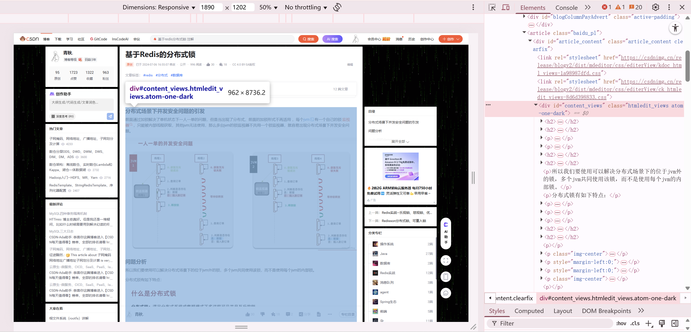
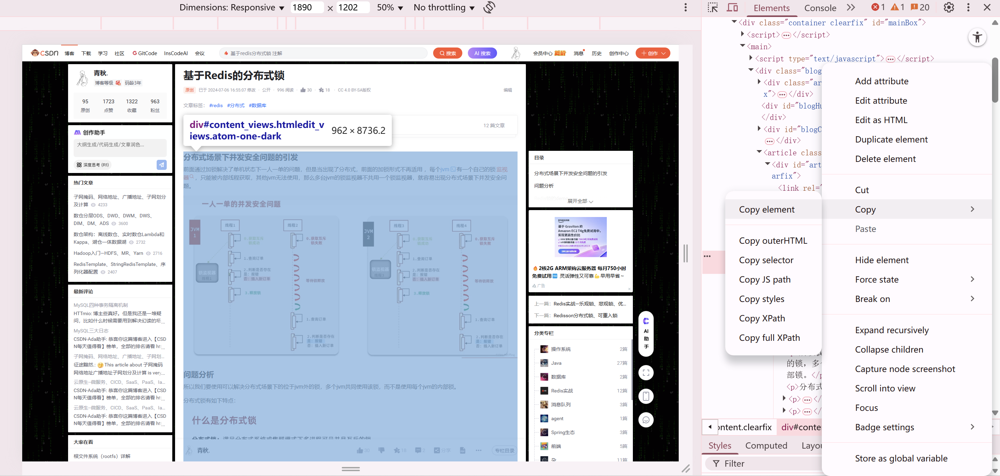

#### 因为搭建了hugo博客，打算把csdn文章都转移到hugo博客上，涉及html转md，一个个弄太麻烦了，就写了这个玩意，根据博客年、月、标题生成文件路径，但是图片还要一个个重新粘贴，因为图片还是csdn的链接，新的博客是加载不到csdn的图片
#### 填写如下几个参数启动即可

#### 效果：

#### 缺陷
实际使用发现对于很长的文章，仅能抓取前部分内容，具体原因没找到
#### 解决方法
浏览器进入F12开发者模式,找到文章内容的html并复制

然后使用该网站：https://www.helloworld.net/html2md
把html转md